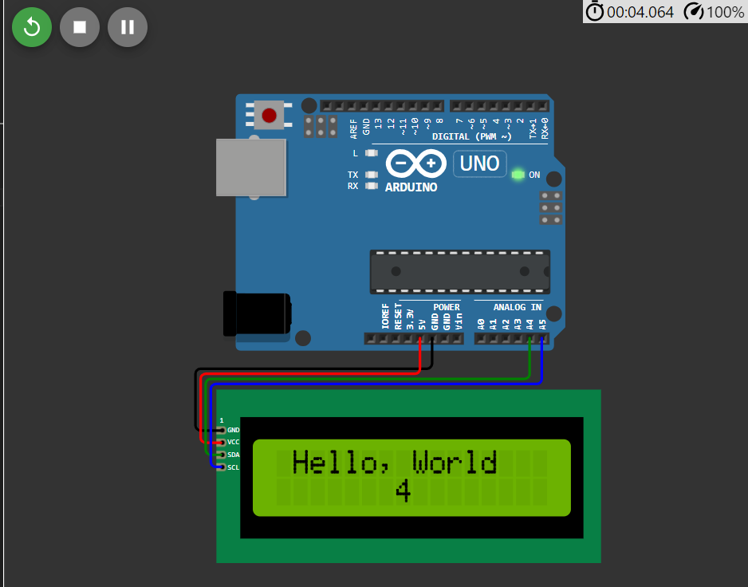

# Construção de Circuitos com Entradas e Saídas Digitais no Arduino

## Introdução
Nos últimos anos, os microcontroladores têm desempenhado um papel importante e têm impulsionando a criação de uma ampla variedade de dispositivos inteligentes e sistemas embarcados. Esses dispositivos compactos, com grande de capacidade de processamento e memória, são capazes de executar tarefas específicas de controle e interação com o ambiente físico.

Uma das plataformas mais populares para desenvolvimento com microcontroladores é o [*Arduino*](https://www.arduino.cc/). Ele oferece uma abordagem acessível e versátil para prototipagem de projetos eletrônicos. Com o *Arduino*, entusiastas, estudantes e profissionais podem criar diversos dispositivos interativos, desde simples sensores e atuadores até sistemas de automação residencial e dispositivos portáteis.

Explorar conceitos iniciais sobre microcontroladores por meio de aplicações simuladas, como é o caso da plataforma [*Wokwi*](https://wokwi.com/), proporciona uma experiência descomplicada, sem riscos e custos. Essa abordagem virtual visa impulsionar o aprendizado ao familiarizar gradualmente os usuários com os microcontroladores. Como uma introdução prática aos fundamentos desses dispositivos, será construído um circuito utilizando as entradas e saídas digitais do *Arduino Uno*.

## Objetivo
O objetivo desta tarefa na disciplina de Laboratório de Microcontroladores e Microprocessadores é familiarizar os alunos à plataforma *Wokwi* e ao uso de microcontroladores, simulando e construindo circuitos com as entradas e saídas digitais do *Arduino Uno*, bem como tornar natural o uso desse microcontrolador para uso em futuras aplicações e com diferentes graus de complexidade. A tarefa aborda conceitos estudados em disciplinas anteriores, como é o caso de *Sinais e Sistemas Digitais* e *Arquitetura e Organização de Computadores*, se diferenciando ao dar grande ênfase ao uso de microcontroladores.

## Metodologia

A tarefa dada é a seguinte:

### Entradas e Saídas Digitais no *Arduino*:
#### **Exercícios**
1. Simule o circuito [*Olá Mundo*](https://wokwi.com/projects/322062421191557714) com o *Arduino* no *Wokwi*.
2. Projete um circuito com *Arduino* conectando a ele dois botões, um LED vermelho e um LED verde. Em seguida faça um programa em que quando um botão é pressionado o LED vermelho acende e o verde fica apagado. Quando o outro botão é pressionado os LEDs se alternam.
3. Projete um circuito com o *Arduino* e um *display* de 7 segmentos, utilizando os pino digitais de 0 a 7 para os segmentos de “a” a “g”, respectivamente. Faça um programa que apresenta o número 9 neste *display*.
4. Adicione 2 botões ao circuito do exercício anterior e faça um programa onde uma contagem de 0 a 9 é apresentada no *display*. O número apresentado deve aumentar ou diminuir conforme os botões são pressionados, um botão aumenta e outro diminui o número apresentado no *display*.
---

Para realizar os exercícios propostos de Entradas e Saídas Digitais no *Arduino*, seguimos os seguintes passos:

1. **Simulação do Circuito *Olá Mundo***:
   - **Componentes Utilizados:** *Arduino Uno*, *display LCD 16x2*.
    

        

            <figure style="text-align: center;">
            
            <figcaption style="text-align: center;"><em><a href="https://docs.arduino.cc/hardware/uno-rev3/">Fig. 1: Arduino Uno</a></em></figcaption>
            </figure>
        

        

            <figure style="text-align: center;">
            
            <figcaption style="text-align: center;"><em><a href="https://docs.arduino.cc/learn/electronics/lcd-displays/">Fig. 2: Display LCD 16x2</a></em></figcaption>
            </figure>
        

    

    
   - **Descrição:** Utilizando a plataforma online *Wokwi* para simular o circuito *Olá Mundo* com o *Arduino* foi possível ver o código utilizado no *Arduino* que faz a inserção de textos no *display 16x2* ligado a ele. Foi possível ainda observar a montagem de circuitos utilizando as portas digitais do microcontrolador e ver como o programa lida com a atualização do *display* utilizado.
   
    - **Ligação dos circuitos e código arduino:**
    

        

            <figure style="text-align: center;">
                
                <figcaption style="text-align: center;"><em>Fig. 3: Circuito montado</em></figcaption>
            </figure>
        

        

            

    <pre><code class="ino" contentEditable="false">
        /* Hello World! */

        #include <LiquidCrystal_I2C.h>

        LiquidCrystal_I2C lcd(0x27, 20, 4);

        void setup() {
            lcd.init();
            lcd.backlight();
            lcd.setCursor(1, 0);
            lcd.print("Hello, World!");
        }

        void loop() {
            lcd.setCursor(7, 1);
            lcd.print(millis() / 1000);
        }
    </code></pre>
        

            <figcaption style="text-align: center;"><em>Código 1: arquivo .ino que exibe a frase "Hello, World!" no display LCD 16x2, ligado ao Arduino</em></figcaption>
        

    

2. **Projeto de um Circuito com Botões e LEDs**:
    - **Componentes Utilizados**: *Arduino Uno*, dois botões, um LED vermelho e um LED verde.
        

            

                <figure style="text-align: center;">
                
                <figcaption style="text-align: center;"><em><a href="https://docs.arduino.cc/hardware/uno-rev3/">Fig. 5: Arduino Uno</a></em></figcaption>
                </figure>
            

            

                <figure style="text-align: center;">
                
                <figcaption style="text-align: center;"><em><a href="https://circuitdigest.com/electronic-circuits/push-button-led-circuit">Fig. 6: Botão</a></em></figcaption>
                </figure>
            

            

                <figure style="text-align: center;">
                
                <figcaption style="text-align: center;"><em><a href="https://electronicsclub.info/leds.htm">Fig. 7: Led Vermelho e Verde</a></em></figcaption>
                </figure>
            

        

    - **Descrição**: Os participantes projetaram um circuito utilizando o *Arduino* e os componentes mencionados. Em seguida, desenvolveram um programa para controlar o comportamento dos LEDs de acordo com o acionamento dos botões. Quando um botão é pressionado, o LED vermelho acende enquanto o verde fica apagado. Quando o outro botão é pressionado, os LEDs se alternam.

    - **Ligação dos circuitos e código arduino:**
    

        

            <figure style="text-align: center;">
                
                <figcaption style="text-align: center;"><em>Fig. 8: Circuito montado</em></figcaption>
            </figure>
        

        

            

    <pre><code class="ino" contentEditable="false">
        // Define os pinos que serão usados
        const int buttonPin1 = 6;
        const int buttonPin2 = 7; 
        const int ledRedPin = 11; 
        const int ledGreenPin = 10; 
        bool troca = true;
        bool pisca=false;

        // Variáveis para estados dos botões
        int buttonState1 = 0;
        int buttonState2 = 0;

        void setup() {
            // Define os pinos
            pinMode(buttonPin1, INPUT_PULLUP);
            pinMode(buttonPin2, INPUT_PULLUP);
            pinMode(ledRedPin, OUTPUT);
            pinMode(ledGreenPin, OUTPUT);
        }

        void loop() {
            // Lê o estado dos botões
            buttonState1 = digitalRead(buttonPin1);
            buttonState2 = digitalRead(buttonPin2);

            if (buttonState1 == LOW) {
                digitalWrite(ledRedPin, HIGH);
                digitalWrite(ledGreenPin, LOW);
                pisca=false;
            }

            if (buttonState2 == LOW) {
                pisca=true;
            }
            
            if(pisca){
                if(troca){
                    digitalWrite(ledRedPin, LOW);
                    digitalWrite(ledGreenPin, HIGH);
                }else{
                    digitalWrite(ledRedPin, HIGH);
                    digitalWrite(ledGreenPin, LOW);
                }
                // Por causa desse delay, se quiser usar o outro botão será necessário segurar ele
                delay(500);
                troca=!troca;
            }
        }
    </code></pre>
        

            <figcaption style="text-align: center;"><em>Código 2: arquivo .ino para controle de LEDs com botões ligados ao Arduino</em></figcaption>
        

    

3. **Projeto de um Circuito com Display de 7 Segmentos**:
    - **Componentes Utilizados**: *Arduino Uno*, *display* de 7 segmentos.
        

            

                <figure style="text-align: center;">
                
                <figcaption style="text-align: center;"><em><a href="https://docs.arduino.cc/hardware/uno-rev3/">Fig. 9: Arduino Uno</a></em></figcaption>
                </figure>
            

            

                <figure style="text-align: center;">
                
                <figcaption style="text-align: center;"><em><a href="https://www.electronicsforu.com/resources/7-segment-display-pinout-understanding">Fig. 10: Display de 7 segmentos</a></em></figcaption>
                </figure>
            

        

    - **Descrição**: Os participantes projetaram um circuito utilizando o *Arduino* e um *display* de 7 segmentos. Os pinos digitais de 0 a 7 foram atribuídos aos segmentos de "a" a "g", respectivamente. Um programa foi desenvolvido para apresentar o número 9 neste *display*.

    - **Ligação dos circuitos e código arduino:**
    

        

            <figure style="text-align: center;">
                
                <figcaption style="text-align: center;"><em>Fig. 11: Circuito montado</em></figcaption>
            </figure>
        

        

            

    <pre><code class="ino" contentEditable="false">
        const int A=0;
        const int B=1;
        const int C=2;
        const int D=3;
        const int E=4;
        const int F=5;
        const int G=6;

        void setup() {
            pinMode(A, OUTPUT);
            pinMode(B, OUTPUT);
            pinMode(C, OUTPUT);
            pinMode(D, OUTPUT);
            pinMode(E, OUTPUT);
            pinMode(F, OUTPUT);
            pinMode(G, OUTPUT);
        }

        void loop() {
            digitalWrite(A, HIGH);
            digitalWrite(B, HIGH);
            digitalWrite(C, HIGH);
            digitalWrite(D, HIGH);
            //digitalWrite(E, HIGH);
            digitalWrite(F, HIGH);
            digitalWrite(G, HIGH);
        }
    </code></pre>
        

            <figcaption style="text-align: center;"><em>Código 3: arquivo .ino para controle do display de 7 segmentos exibindo o número 9</em></figcaption>
        

    

4. **Adição de Botões ao Circuito do Exercício Anterior**:
   - **Componentes Utilizados**: *Arduino Uno*, *display* de 7 segmentos, dois botões.
        

            

                <figure style="text-align: center;">
                
                <figcaption style="text-align: center;"><em><a href="https://docs.arduino.cc/hardware/uno-rev3/">Fig. 12: Arduino Uno</a></em></figcaption>
                </figure>
            

            

                <figure style="text-align: center;">
                
                <figcaption style="text-align: center;"><em><a href="https://www.electronicsforu.com/resources/7-segment-display-pinout-understanding">Fig. 13: Display de 7 segmentos</a></em></figcaption>
                </figure>
            

            

                <figure style="text-align: center;">
                
                <figcaption style="text-align: center;"><em><a href="https://circuitdigest.com/electronic-circuits/push-button-led-circuit">Fig. 14: Botão</a></em></figcaption>
                </figure>
            

        

   - **Descrição**: Os participantes modificaram o circuito do exercício anterior, adicionando dois botões. Em seguida, desenvolveram um programa que realiza uma contagem de 0 a 9 no *display* de 7 segmentos. O número apresentado aumenta ou diminui conforme os botões são pressionados, sendo um botão responsável por aumentar e o outro por diminuir o número exibido.

    - **Ligação dos circuitos e código arduino:**
    

        

            <figure style="text-align: center;">
                
                <figcaption style="text-align: center;"><em>Fig. 15: Circuito montado</em></figcaption>
            </figure>
        

        

            

    <pre><code class="ino" contentEditable="false">
        const int A=0;
        const int B=1;
        const int C=2;
        const int D=3;
        const int E=4;
        const int F=5;
        const int G=6;
        const int AumentaB=12;
        int Aumenta=HIGH;
        const int DiminuiB=13;
        int Diminui=HIGH;
        int count=0;

        void setup() {
            pinMode(AumentaB, INPUT_PULLUP);
            pinMode(DiminuiB, INPUT_PULLUP);
            pinMode(A, OUTPUT);
            pinMode(B, OUTPUT);
            pinMode(C, OUTPUT);
            pinMode(D, OUTPUT);
            pinMode(E, OUTPUT);
            pinMode(F, OUTPUT);
            pinMode(G, OUTPUT);
        }

        void loop() {
            Aumenta=digitalRead(AumentaB);
            Diminui=digitalRead(DiminuiB);
            if(Aumenta==LOW&&count<9)
                count++;
            else if(Diminui==LOW&&count>0)
                count--;
            // A - Presente em todos a não ser 1 e 4
            if(count!=1&&count!=4) 
                digitalWrite(A, HIGH);
            else digitalWrite(A, LOW);
            // B - Presente em todos a não ser 5 e 6
            if(count!=5&&count!=6) 
                digitalWrite(B, HIGH);
            else digitalWrite(B, LOW);
            // C - Presente em todos a não ser 2
            if(count!=2) 
                digitalWrite(C, HIGH);
            else digitalWrite(C, LOW);
            // D - Presente em todos a não ser 1, 4 e 7
            if(count!=1&&count!=4&&count!=7) 
                digitalWrite(D, HIGH);
            else digitalWrite(D, LOW);
            // E - Presente apenas em 0,2,6 e 8
            if(count==0||count==2||count==6||count==8) 
                digitalWrite(E, HIGH);
            else digitalWrite(E, LOW);
            // F - Presente apenas em 0,4,5,6,8 e 9
            if(count==0||count==4||count==5||
            count==6||count==8||count==9) 
                digitalWrite(F, HIGH);
            else digitalWrite(F, LOW);
            // G - Presente em todos a não ser 0, 1 e 7
            if(count!=0&&count!=1&&count!=7) 
                digitalWrite(G, HIGH);
            else digitalWrite(G, LOW);
            delay(60);
        }
    </code></pre>
        

            <figcaption style="text-align: center;"><em>Código 4: arquivo .ino para controle dos botões de contagem ligados ao Arduino</em></figcaption>
        

    

## Resultados
Após realizar as práticas, foi possível simular os exercícios propostos em sala de aula demonstrados abaixo: 

- **Simulação do Circuito *Olá Mundo***:

    

        <figure style="text-align: center;">
            
            <figcaption style="text-align: center;"><em>Fig. 16: Simulação em execução</em></figcaption>
        </figure>
    

    Após a realização do circuito foi possível executar o projeto proposto para simular o "Olá Mundo" com o Arduino no Wokwi.

 - **Projeto de um Circuito com Botões e LEDs**: 
 

            

                <figure style="text-align: center;">
                
                <figcaption style="text-align: center;"><em><a href="https://docs.arduino.cc/hardware/uno-rev3/">Fig. 17: Simulação em execução</a></em></figcaption>
                </figure>
            

            

                <figure style="text-align: center;">
                
                <figcaption style="text-align: center;"><em><a href="https://www.electronicsforu.com/resources/7-segment-display-pinout-understanding">Fig. 18: Simulação em execução</a></em></figcaption>
                </figure>
            

        

    O experimento demonstra a interatividade do Arduino ao controlar LEDs através de botões.

- **Projeto de um Circuito com Display de 7 Segmentos**:

    <figure style="text-align: center;">
        
        <figcaption style="text-align: center;"><em>Fig. 19: Simulação em execução</em></figcaption>
    </figure>

Após finalizar o experimento foi possivel observar a capacidade do Arduino em controlar displays de 7 segmentos para exibir o númeor 9.

**Adição de Botões ao Circuito do Exercício Anterior**:

            

                <figure style="text-align: center;">
                
                <figcaption style="text-align: center;"><em><a href="https://docs.arduino.cc/hardware/uno-rev3/">Fig. 17: Simulação em execução</a></em></figcaption>
                </figure>
            

            

                <figure style="text-align: center;">
                
                <figcaption style="text-align: center;"><em><a href="https://www.electronicsforu.com/resources/7-segment-display-pinout-understanding">Fig. 18: Simulação em execução</a></em></figcaption>
                </figure>
            

               

                <figure style="text-align: center;">
                
                <figcaption style="text-align: center;"><em><a href="https://www.electronicsforu.com/resources/7-segment-display-pinout-understanding">Fig. 18: Simulação em execução</a></em></figcaption>
                </figure>
            

        

Como demosntrado acima, foi possível exibir no display a contagem dos número de 0 a 9.
 
Links para os projetos:

* [Exercício 01/Wokwi](https://wokwi.com/projects/322062421191557714) 
* [Exercício 02/Wokwi](https://wokwi.com/projects/394156033331546113) 
* [Exercício 03/Wokwi](https://wokwi.com/projects/393575958384177153) 
* [Exercício 04/Wokwi](https://wokwi.com/projects/393577313414001665) 

## Conclusão

## Referências
- Arduino. Disponível em: https://www.arduino.cc/. Acesso em: 01 de abril de 2024.
- Wokwi. Disponível em: https://wokwi.com/. Acesso em: 01 de abril de 2024.
- Circuito "Olá Mundo" plataforma Wokwi. Disponível em: https://wokwi.com/projects/322062421191557714. Acesso em: 03 de abril de 2024.
- Arduino Uno. Disponível em: https://docs.arduino.cc/hardware/uno-rev3/. Acesso em: 03 de abril de 2024.
- LCD 16x2. Disponível em: https://docs.arduino.cc/learn/electronics/lcd-displays/. Acesso em: 03 de abril de 2024.
- Push Button. Disponível em: https://circuitdigest.com/electronic-circuits/push-button-led-circuit. Acesso em: 04 de abril de 2024.
- Led. Disponível em: https://electronicsclub.info/leds.htm. Acesso em: 04 de abril de 2024.
- Display de 7 segmentos. Disponível em: https://www.electronicsforu.com/resources/7-segment-display-pinout-understanding. Acesso em: 04 de abril de 2024.
