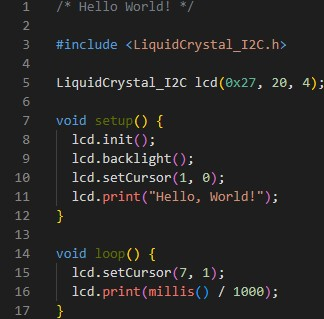

# Construção de Circuitos com Entradas e Saídas Digitais no Arduino

## Resumo

## Introdução
Nos últimos anos, os microcontroladores têm desempenhado um papel importante e têm impulsionando a criação de uma ampla variedade de dispositivos inteligentes e sistemas embarcados. Esses dispositivos compactos, com grande de capacidade de processamento e memória, são capazes de executar tarefas específicas de controle e interação com o ambiente físico.

Uma das plataformas mais populares para desenvolvimento com microcontroladores é o [*Arduino*](https://www.arduino.cc/). Ele oferece uma abordagem acessível e versátil para prototipagem de projetos eletrônicos. Com o *Arduino*, entusiastas, estudantes e profissionais podem criar diversos dispositivos interativos, desde simples sensores e atuadores até sistemas de automação residencial e dispositivos portáteis.

Explorar conceitos iniciais sobre microcontroladores por meio de aplicações simuladas, como é o caso da plataforma [*Wokwi*](https://wokwi.com/), proporciona uma experiência descomplicada, sem riscos e custos. Essa abordagem virtual visa impulsionar o aprendizado ao familiarizar gradualmente os usuários com os microcontroladores. Como uma introdução prática aos fundamentos desses dispositivos, será construído um circuito utilizando as entradas e saídas digitais do *Arduino Uno*.

## Objetivo
O objetivo desta tarefa na disciplina de Laboratório de Microcontroladores e Microprocessadores é familiarizar os alunos à plataforma *Wokwi* e ao uso de microcontroladores, simulando e construindo circuitos com as entradas e saídas digitais do *Arduino Uno*, bem como tornar natural o uso desse microcontrolador para uso em futuras aplicações e com diferentes graus de complexidade. A tarefa aborda conceitos estudados em disciplinas anteriores, como é o caso de *Sinais e Sistemas Digitais* e *Arquitetura e Organização de Computadores*, se diferenciando ao dar grande ênfase ao uso de microcontroladores.

## Metodologia

A tarefa dada é a seguinte:

### Entradas e Saídas Digitais no *Arduino*:
#### **Exercícios**
1. Simule o circuito [*Olá Mundo*](https://wokwi.com/projects/322062421191557714) com o *Arduino* no *Wokwi*.
2. Projete um circuito com *Arduino* conectando a ele dois botões, um LED vermelho e um LED verde. Em seguida faça um programa em que quando um botão é pressionado o LED vermelho acende e o verde fica apagado. Quando o outro botão é pressionado os LEDs se alternam.
3. Projete um circuito com o *Arduino* e um *display* de 7 segmentos, utilizando os pino digitais de 0 a 7 para os segmentos de “a” a “g”, respectivamente. Faça um programa que apresenta o número 9 neste *display*.
4. Adicione 2 botões ao circuito do exercício anterior e faça um programa onde uma contagem de 0 a 9 é apresentada no *display*. O número apresentado deve aumentar ou diminuir conforme os botões são pressionados, um botão aumenta e outro diminui o número apresentado no *display*.
---

Para realizar os exercícios propostos de Entradas e Saídas Digitais no *Arduino*, seguimos os seguintes passos:

1. **Simulação do Circuito *Olá Mundo***:
   - Componentes Utilizados: *Arduino Uno*, *display LCD 16x2*.
    

        

            <figure style="text-align: center;">
            
            <figcaption style="text-align: center;"><em><a href="https://docs.arduino.cc/hardware/uno-rev3/">Fig. 1: Arduino Uno</a></em></figcaption>
            </figure>
        

        

            <figure style="text-align: center;">
            
            <figcaption style="text-align: center;"><em><a href="https://docs.arduino.cc/learn/electronics/lcd-displays/">Fig. 2: Display LCD 16x2</a></em></figcaption>
            </figure>
        

    

    
   - Descrição: Utilizando a plataforma online *Wokwi* para simular o circuito *Olá Mundo* com o *Arduino* foi possível ver o código utilizado no *Arduino* que faz a inserção de textos no *display 16x2* ligado a ele. Foi possível ainda observar a montagem de circuitos utilizando as portas digitais do microcontrolador e ver como o programa lida com a atualização do *display* utilizado.

   - Ligação dos circuitos e código arduino:
   

        

            <figure style="text-align: center;">
            
            <figcaption style="text-align: center;"><em>Fig. 3: Circuito montado</em></figcaption>
            </figure>
        

        

            <figure style="text-align: center;">
            
            <figcaption style="text-align: center;"><em>Fig. 4: Código Arduino</em></figcaption>
            </figure>
        

    

2. **Projeto de um Circuito com Botões e LEDs**:
   - **Componentes Utilizados**: *Arduino Uno*, dois botões, um LED vermelho e um LED verde.
        

            

                <figure style="text-align: center;">
                
                <figcaption style="text-align: center;"><em><a href="https://docs.arduino.cc/hardware/uno-rev3/">Fig. 5: Arduino Uno</a></em></figcaption>
                </figure>
            

            

                <figure style="text-align: center;">
                
                <figcaption style="text-align: center;"><em><a href="https://circuitdigest.com/electronic-circuits/push-button-led-circuit">Fig. 6: Botão</a></em></figcaption>
                </figure>
            

            

                <figure style="text-align: center;">
                
                <figcaption style="text-align: center;"><em><a href="https://electronicsclub.info/leds.htm">Fig. 7: Led Vermelho e Verde</a></em></figcaption>
                </figure>
            

        

   - **Descrição**: Os participantes projetaram um circuito utilizando o *Arduino* e os componentes mencionados. Em seguida, desenvolveram um programa para controlar o comportamento dos LEDs de acordo com o acionamento dos botões. Quando um botão é pressionado, o LED vermelho acende enquanto o verde fica apagado. Quando o outro botão é pressionado, os LEDs se alternam.

   - Ligação dos circuitos e código arduino:
   

        

            <figure style="text-align: center;">
            
            <figcaption style="text-align: center;"><em>Fig. 3: Circuito montado</em></figcaption>
            </figure>
        

        

            <figure style="text-align: center;">
            
            <figcaption style="text-align: center;"><em>Fig. 4: Código Arduino</em></figcaption>
            </figure>
        

    

3. **Projeto de um Circuito com Display de 7 Segmentos**:
   - **Componentes Utilizados**: *Arduino Uno*, *display* de 7 segmentos.
        

            

                <figure style="text-align: center;">
                
                <figcaption style="text-align: center;"><em><a href="https://docs.arduino.cc/hardware/uno-rev3/">Fig. 10: Arduino Uno</a></em></figcaption>
                </figure>
            

            

                <figure style="text-align: center;">
                
                <figcaption style="text-align: center;"><em><a href="https://www.electronicsforu.com/resources/7-segment-display-pinout-understanding">Fig. 11: Display de 7 segmentos</a></em></figcaption>
                </figure>
            

        

   - **Descrição**: Os participantes projetaram um circuito utilizando o *Arduino* e um *display* de 7 segmentos. Os pinos digitais de 0 a 7 foram atribuídos aos segmentos de "a" a "g", respectivamente. Um programa foi desenvolvido para apresentar o número 9 neste *display*.
   - Ligação dos circuitos e código arduino:
   

        

            <figure style="text-align: center;">
            
            <figcaption style="text-align: center;"><em>Fig. 12: Circuito montado</em></figcaption>
            </figure>
        

        

            <figure style="text-align: center;">
            
            <figcaption style="text-align: center;"><em>Fig. 13: Código Arduino</em></figcaption>
            </figure>
        

    

4. **Adição de Botões ao Circuito do Exercício Anterior**:
   - **Componentes Utilizados**: *Arduino Uno*, *display* de 7 segmentos, dois botões.
        

            

                <figure style="text-align: center;">
                
                <figcaption style="text-align: center;"><em><a href="https://docs.arduino.cc/hardware/uno-rev3/">Fig. 14: Arduino Uno</a></em></figcaption>
                </figure>
            

            

                <figure style="text-align: center;">
                
                <figcaption style="text-align: center;"><em><a href="https://www.electronicsforu.com/resources/7-segment-display-pinout-understanding">Fig. 15: Display de 7 segmentos</a></em></figcaption>
                </figure>
            

            

                <figure style="text-align: center;">
                
                <figcaption style="text-align: center;"><em><a href="https://circuitdigest.com/electronic-circuits/push-button-led-circuit">Fig. 16: Botão</a></em></figcaption>
                </figure>
            

        

   - **Descrição**: Os participantes modificaram o circuito do exercício anterior, adicionando dois botões. Em seguida, desenvolveram um programa que realiza uma contagem de 0 a 9 no *display* de 7 segmentos. O número apresentado aumenta ou diminui conforme os botões são pressionados, sendo um botão responsável por aumentar e o outro por diminuir o número exibido.
   - Ligação dos circuitos e código arduino:
   

        

            <figure style="text-align: center;">
            
            <figcaption style="text-align: center;"><em>Fig. 17: Circuito montado</em></figcaption>
            </figure>
        

        

            <figure style="text-align: center;">
            
            <figcaption style="text-align: center;"><em>Fig. 18: Código Arduino</em></figcaption>
            </figure>
        

    

## Resultados

Links para os projetos:

* [Exercício 01/Wokwi](https://wokwi.com/projects/322062421191557714) 
* [Exercício 02/Wokwi](https://wokwi.com/projects/394156033331546113) 
* [Exercício 03/Wokwi](https://wokwi.com/projects/393575958384177153) 
* [Exercício 04/Wokwi](https://wokwi.com/projects/393577313414001665) 

## Conclusão

## Referências